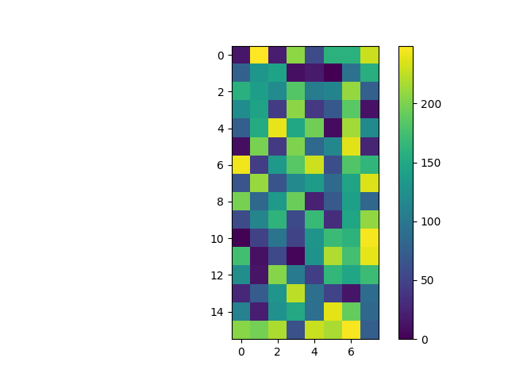

# CS689 - Assign2
[source code](https://github.com/RupakBiswas-2304/CS689/tree/main/assignment2)

### Hash Function
- The hash function has beed implemented in `hash_function.py` file.
- The hash function is based on [8bit Pearson Hash](https://en.wikipedia.org/wiki/Pearson_hashing)
- This hash function is safe (if we ignore the hash size) for classical computer. 
- To demonstrate it's safeness, we can plot it for upto certain number and check for any pattern to show up.
##### Usages
- Run `python3 hash_function.py --n 4 --extend 3`
- `--n` is the number of bits in the hash
- `--extend` means plot will be extended to $(2^n)*extend$ number of points

##### Output

- The above plot is for 8bit Pearson hash function and it shows randomness.

### Grover's Search Algorithm
##### Overview
- Create Super Position of All State
	- User Hadamard gate on all gates 
	- $H^{\otimes n}|00..0> = s$
- Now our goal is to get near to desired state $|\omega>$
- Pass through Oracle
	- It introduce negative phase to desired state
	- We pass through f then apply n bit cnot
	- with our desired state as control bit
	- then reverse the f (pass through f inverse )
- Diffusion 
	- Pass through Hadamard
	- Anti-controlled Cnot
	- Pass through Hadamard
- Repeat sqrt(N)*(pi/4) times.


### Implementation
- The overall circuit for `4bit` looks like this ..
```
        ┌─────┐┌─────┐┌──────┐┌─────────┐┌─────┐┌─────┐┌──────┐┌─────────┐┌─────┐ ░ ┌─┐         
   q_0: ┤0    ├┤0    ├┤0     ├┤0        ├┤0    ├┤0    ├┤0     ├┤0        ├┤0    ├─░─┤M├─────────
        │     ││     ││      ││         ││     ││     ││      ││         ││     │ ░ └╥┘┌─┐      
   q_1: ┤1 Hn ├┤1 Uf ├┤1     ├┤1 Uf_rev ├┤1    ├┤1 Uf ├┤1     ├┤1 Uf_rev ├┤1    ├─░──╫─┤M├──────
        │     ││     ││  nCX ││         ││  Dn ││     ││  nCX ││         ││  Dn │ ░  ║ └╥┘┌─┐   
   q_2: ┤2    ├┤2    ├┤2     ├┤2        ├┤2    ├┤2    ├┤2     ├┤2        ├┤2    ├─░──╫──╫─┤M├───
        └┬───┬┘└┬───┬┘│      │└─────────┘│     │└─────┘│      │└─────────┘│     │ ░  ║  ║ └╥┘┌─┐
     y: ─┤ X ├──┤ H ├─┤3     ├───────────┤3    ├───────┤3     ├───────────┤3    ├─░──╫──╫──╫─┤M├
         └───┘  └───┘ └──────┘           └─────┘       └──────┘           └─────┘ ░  ║  ║  ║ └╥┘
meas: 4/═════════════════════════════════════════════════════════════════════════════╩══╩══╩══╩═
                                                                                     0  1  2  3 
```
- The circuit is implemented in `grover_search.py` file.
- Here are several component 
- `Hn` gate is just a n qbit hadamard gate
- `Uf` and `Uf_rev` are query function and it's inverse operation
    - This `Uf` and `Uf_rev` is created from `utility.py` file `CustomGate` class
    - This file can be run infividually and it creates a random permutation of $2^n$ bit
    - This permutation is saved in `input_folder`, we can check the truth table by 
    - `python3 utility.py --qbit 3 --generate --save`
    - Here `--generate` and `--save` are optional and does what it says
- `cCX` is a n qbit controlled and anticontrolled x gate
- Here is more what inside..
```
     ┌───┐     ┌───┐
q_0: ┤ X ├──■──┤ X ├
     ├───┤  │  ├───┤
q_1: ┤ X ├──■──┤ X ├
     ├───┤  │  ├───┤
q_2: ┤ X ├──■──┤ X ├
     └───┘┌─┴─┐└───┘
  y: ─────┤ X ├─────
          └───┘     
```
- The next part is `Dn` or nqbit diffusion gate
```
     ┌─────┐┌───┐     ┌───┐┌─────┐
q_0: ┤0    ├┤ X ├──■──┤ X ├┤0    ├
     │     │├───┤  │  ├───┤│     │
q_1: ┤1 Hn ├┤ X ├──■──┤ X ├┤1 Hn ├
     │     │├───┤  │  ├───┤│     │
q_2: ┤2    ├┤ X ├──■──┤ X ├┤2    ├
     └─────┘└───┘┌─┴─┐└───┘└─────┘
q_3: ────────────┤ X ├────────────
                 └───┘            
```

### Usages
- Run `python3 main.py --n 3 --iteration 1`
- Here `n` implies number of qbit and `iteration` implies number of time we will query
- The output will be like this
```
{'000101101': 485, '100101101': 515}
Query: 23, Result: 45
```